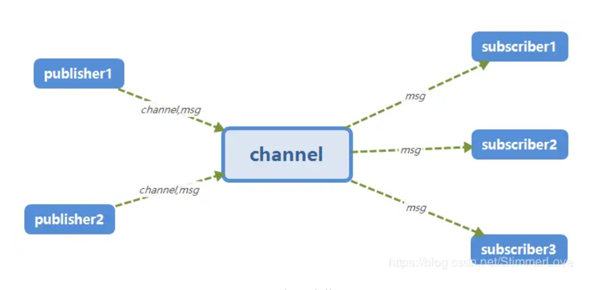
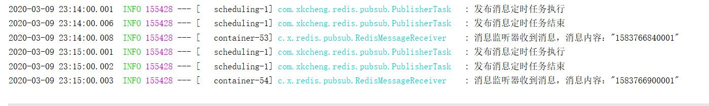

--- 
title: Redis进阶之发布订阅模式
date: 2020-03-09
categories: 
 - 后端
author:  61
tags: 
 - redis
---
::: tip 介绍
通过本篇文章，可以了解Redis中的发布订阅（pub/sub）模式，并通过例子学习如何在springboot中使用
:::
<!-- more -->
## 简介
Redis 发布订阅(pub/sub)是一种消息通信模式：发送者(pub)发送消息，订阅者(sub)接收消息。<br>
redis发布订阅功能用于消息的传输；redis发布订阅机制包含3个部分：发布者，订阅者，channel(频道)

发布者和订阅者都是redis客户端，channel是redis服务器端，发布者将消息发布到某一频道上，订阅了这一频道的订阅者就会收到该条信息。

## 命令介绍
1. PUBLISH channel message
- 说明：用于发布者将消息发送到指定的频道
- 参数：channel（频道名称），message（将要发送的消息）
- 返回：接收到此消息的订阅者数量
2. SUBSCRIBE channel [channel2 ...]
- 说明：用于订阅者订阅一个或多个频道的信息
- 参数：channel（频道名称）
- 返回：接收到发布者发布的消息

## Springboot使用Redis的发布订阅
### 配置消息处理器
```java
/**
 * 功能描述：消息监听类，监听订阅的频道的消息
 *
 * @Author xkcheng
 * @Date 2020/3/9
 **/
@Component
public class RedisMessageReceiver {

	private static Logger Log = LoggerFactory.getLogger(RedisMessageReceiver.class);

	/**
	 * 方法描述: 消息处理器方法
	 * @param message  订阅的频道发布的消息
	 * @return:
	 * @author: xkcheng
	 * @date: 2020/3/9 22:15
	 */
	public void receiverMessage(String message){
		Log.info("消息监听器收到消息，消息内容：{}", message);
	}
}
```
### 消息发布订阅配置类
    配置哪些频道发布的消息由哪些消息处理器进行处理
```java
/**
 * 功能描述：消息发布订阅配置类
 *
 * @Author xkcheng
 * @Date 2020/3/9
 **/
@Configuration
public class RedisMessageConfig {

	/**
	 * 方法描述: 配置消息监听容器
	 * @param redisConnectionFactory   redis连接配置
	 * @param messageListenerAdapter   消息监听适配器
	 * @return: {@link RedisMessageListenerContainer}
	 * @author: xkcheng
	 * @date: 2020/3/9 21:39
	 */
	@Bean
	public RedisMessageListenerContainer container(RedisConnectionFactory redisConnectionFactory,
	                                               MessageListenerAdapter messageListenerAdapter){
		RedisMessageListenerContainer container = new RedisMessageListenerContainer();
		container.setConnectionFactory(redisConnectionFactory);
		// 可配置多个消息监听适配器
		container.addMessageListener(messageListenerAdapter ,new PatternTopic("channel:pubsub"));
		return  container;
	}

	/**
	 * 方法描述: 配置消息监听适配器
	 * @param receiver  真正的消息处理器
	 * @return: {@link MessageListenerAdapter}
	 * @author: xkcheng
	 * @date: 2020/3/9 21:44
	 */
	@Bean
	public MessageListenerAdapter messageListenerAdapter(RedisMessageReceiver receiver) {
		return  new MessageListenerAdapter(receiver, "receiverMessage");
	}
}
```
### 定时任务模拟发布消息
```java
/**
 * 功能描述：发布订阅模式 发布者定时任务
 *
 * @Author xkcheng
 * @Date 2020/3/9
 **/
@Component
@EnableScheduling
public class PublisherTask {

	private static final String CHANNEL = "channel:pubsub";

	private static Logger Log = LoggerFactory.getLogger(PublisherTask.class);

	@Autowired
	private RedisTemplateUtil redisTemplateUtil;

	/**
	 * 每一分钟执行一次定时任务
	 */
	@Scheduled(cron = "0 0/1 * * * ?")
	public void publisher(){
		Log.info("发布消息定时任务执行");
		// 向 channel:pubsub 频道发布消息
		redisTemplateUtil.publisher(CHANNEL, "" + System.currentTimeMillis());
		Log.info("发布消息定时任务结束");
	}
}
```
### 运行结果

可以看到发布者向频道发布了消息，随后订阅者从频道拿到了发布者发布的消息。