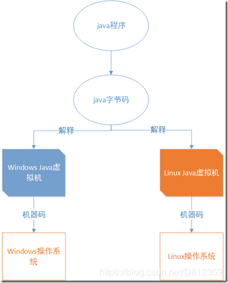
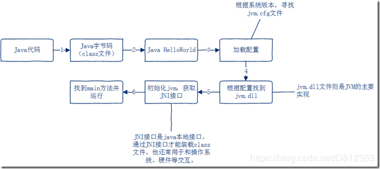
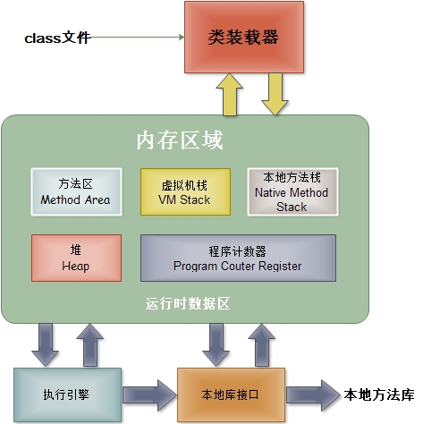

--- 
title: jvm 基础知识
date: 2020-07-16
categories: 
 - JVM
author:  61
tags: 
 - database
 - 笔记
---

# JVM基础知识整理

## 一、什么是JVM

即`java`虚拟机，是由软件技术模拟出计算机运行的一个**虚拟的计算机**。顾名思义，就是将我们编写的代码翻译成机器可以识别的机器语言。

`java`程序经过一次**编译**之后，将`java`代码编译为字节码也就是`class`文件，然后在不同的操作系统上依靠不同的`java`虚拟机进行解释，最后在转换为不同平台的机器码，最终得到执行。



一个普通的java程序它的执行流程到底是怎样的呢?

```java
public class HelloWorld {
    public static void main(String[] args) {
        System.out.print("Hello world");
    }
}
```

这段程序从编译到运行，最终打印出`Hello world`中间经过了哪些步骤呢？我们直接上图



`vm.cfg`位于 `jdk/jre/lib/amd64/jvm.cfg`下

`jvm.dll`位于`jdk\jre\bin\server\jvm.dll`下

简而言之就是通过`jvm.cfg`文件找到对应的`jvm.dll`，**jvm.dll则是java虚拟机的主要实现**。接下来会初始化`JVM`,并且获取**JNI接口**，什么是JNI接口，就是**java本地接口**，你想啊`java`被编译成了`class`文件，JVM怎么从硬盘上找到这个文件并装载到JVM里呢，就是通过JNI接口（它还常用于java与操作系统、硬件交互），找到class文件后并装载进JVM，然后找到main方法，最后执行。


## 二、JVM基本概念



从这个结构不难看出，`class`文件被`jvm`装载以后，经过`jvm`的内存空间调配，最终是由**执行引擎**完成`class`文件的执行。当然这个过程还有其他角色模块的协助，这些模块协同配合才能让一个`java`程序成功的运行。

## 方法区

它存储的是整个Java class文件的信息，存储已被虚拟机加载的类信息、常量、字符串常量、类静态变量、即时编译器编译后的代码等数据。