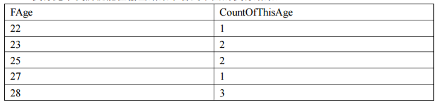
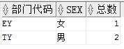
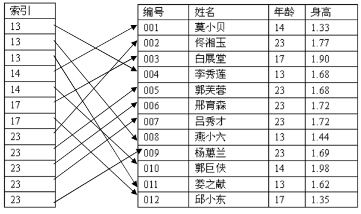
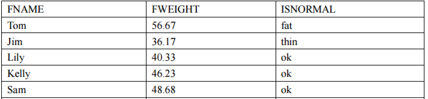

--- 
title: SQL笔记
date: 2019-10-19
categories: 
 - 数据库
author:  61
tags: 
 - database
 - SQL
 - 笔记
---

# SQL笔记

## 基本语句
### 数据表操作

##### 创建表

```
CREATE TABLE 表名
(
字段名 1 字段类型 约束，
字段名 2 字段类型 约束，
字段名 3 字段类型 约束，
………………
主键定义,
外键定义, 
………………
)
```
> 非空约束`NOT NULL`，默认值`DEFAULT 默认值表达式`,主键`PRIMARY KEY(字段名,...)`(可定义联合主键),外键`FOREIGN KEY (外键字段名称) REFERENCES 目标表名(被关联的字段名称)`

##### 修改数据表名
&emsp;&emsp;添加字段：
```
ALTER TABLE 待修改的表名 ADD 字段名 字段类型
```
&emsp;&emsp;删除字段：
```
ALTER TABLE 待修改的表名 DROP 待删除的字段名
```
&emsp;&emsp;修改字段类型：
```
alter table 表名 modify column 字段名 type
```
&emsp;&emsp;修改字段名：
```
alter table 表名 rename column A to B
```
&emsp;&emsp;修改和添加默认值：
```
alter table 表名 add default (0) for 字段名 with values
```

##### 删除数据表
```
DROP TABLE 要删除的表名
```
### 数据操作
##### 增加数据
```
INSERT INTO T_Person(FName,FAge,FRemark) VALUES('Tom',18,'USA')3
```
> 按列顺序插入可以简化插入语句，比如：`INSERT INTO T_Person VALUES('luren1',23,'China') `。

##### 删除数据
```
DELETE FROM T_Debt
```
> 删除T_Debt表的所有数据，删除特定行的话，后面就跟`where`字句，**mysql中用`truncate T_Debt`删除所有数据**。

##### 修改数据
```
UPDATE T_Person SET FRemark = 'SuperMan'
```
> 这条语句是将T_Person表中记录的所有FRemark字段进行修改，想要修改特定行，后面可以跟选择语句`where`。

### 数据检索
##### 排序
```
SELECT * FROM T_Employee ORDER BY FAge
```
> 默认是`ASC`升序，` DESC`为降序。`order by`后面可以跟多个条件，当第一个条件都相同时，按后面的条件排序。

##### 通配符

| 通配符 | 描述 |
|----|----|
| _  |  匹配单字符   |
|  %  |  匹配0个或多个字符  |
|[]|集合匹配符，比如`[ab]%`表示匹配a或b字符任意次。|
|^|取反，比如`[^ab]`%除了a和b可以匹配任意次其他字符。|
```
SELECT * FROM T_Employee
WHERE FName LIKE 'S%' OR FName LIKE 'J%'
```

### 选择语句
##### NOT语句
```
SELECT * FROM T_Employee
WHERE NOT(FAge=22) AND NOT(FSALARY<2000) 
```

##### IN语句
```
SELECT FAge,FNumber,FName FROM T_Employee
WHERE FAge IN (23,25,28) 
```

##### BETWEEN语句
```
SELECT * FROM T_Employee
WHERE FAGE BETWEEN 23 AND 27 
```

### 数据分组
```
SELECT FAge,COUNT(*) AS CountOfThisAge FROM T_Employee
GROUP BY FAge 
```
> 运行结果如下：
> 

```
SELECT FAge,COUNT(*) AS CountOfThisAge FROM T_Employee
GROUP BY FAge
HAVING COUNT(*)>1 
```
> 聚合函数不能在`where`语句中使用，所有使用`having`语句作条件选择。

&emsp;&emsp;**也可以对多个条件进行分组，比如：统计每个部门的男女人数。**请看下面示例：
```
SELECT departmentid as 部门代码, sex, COUNT(*) 总数 FROM EMPLOYEE GROUP BY departmentid, sex
```
> 运行结果：
> 

## 联合结果集

### UNION
&emsp;&emsp;有的时候我们需要组合两个完全不同的查询结果集，而这两个查询结果之间没有必然的
联系，只是我们需要将他们显示在一个结果集中而已。在SQL中可以使用UNION运算符来
将两个或者多个查询结果集联合为一个结果集中。
```
SELECT FNumber,FName,FAge FROM T_Employee
UNION
SELECT FIdCardNumber,FName,FAge FROM T_TempEmployee 
```
> 联合结果集的原则：一是每个结果集必须有相同的列数；二是每个结果集的列必须类型相
容。

&emsp;&emsp;**如果列数不同，则添加一列默认值**:
```
SELECT FNumber,FName,FAge,FDepartment FROM T_Employee
UNION
SELECT FIdCardNumber,FName,FAge,'临时工，不属于任何一个部门' FROM
T_TempEmployee 
```

### UNION ALL
**`UNION`默认会合并相同的数据记录，使用`UNION ALL`则不会。**

## 索引
&emsp;&emsp;如果数据表中数据非常多，我们想从里面找数据就会浪费很多的资源，索引就像一本书的目录一样，可以让我们快速找到需要的数据，如下图所示：


### 创建索引
```
CREATE INDEX 索引名 ON 表名(字段 1, 字段 2,……字段 n)
```
### 删除索引
```
DROP INDEX 索引名 ON 表名
```

## 表连接

当需要从两张或几张表中检索出想要的数据时，如果用嵌套查询会比较麻烦，此时就会用到表连接。**需要注意表连接是把后面的表向右拼接，联合结果集是把后面的表向下拼接。**

### 内连接
```
SELECT FNumber,FPrice
FROM T_Order INNER JOIN T_Customer
ON FCustomerId=T_Customer.FId
WHERE T_Customer.FName='TOM' 
```
### 交叉连接
交叉连接不需要使用`ON`字句，将涉及到的所有表中的所有记录包含在结果集中。
```
SELECT T_Customer.FId, T_Customer.FName, T_Customer.FAge,
T_Order.FId, T_Order.FNumber, T_Order.FPrice
FROM T_Customer, T_Order 
```
### 自连接
```
SELECT o1.FNumber,o1.FPrice,o1.FTypeId,
o2.FNumber,o2.FPrice,o2.FTypeId
FROM T_Order o1
INNER JOIN T_Order o2
ON o1.FTypeId=o2.FTypeId 
```
> 需要使用别名。

### 外连接
&emsp;&emsp;外连接分为:左外连接、右外连接、全外连接。左外连接不管左边符不符合条件都会显示出来，相对的右表则显示空值，右连接和左连接相对，全外连接，不管符不符合条件，都会显示两表的所有记录。
```
SELECT o.FNumber,o.FPrice,o.FCustomerId,
c.FName,c.FAge
FROM T_Order o
LEFT OUTER JOIN T_Customer c
ON o.FCustomerId=c.FId
WHERE o.FPrice>=150 
```
> 右外连接`RIGHT OUTER JOIN`，全外连接`FULL OUTER JOIN`。

## 函数

### distinct

根据某一字段来去重记录

### CASE函数
&emsp;&emsp;**第一种用法：**
```
SELECT
FName,
 (CASE FName
WHEN 'Tom' THEN 'GoodBoy'
WHEN 'Lily' THEN 'GoodGirl'
WHEN 'Sam' THEN 'BadBoy'
WHEN 'Kerry' THEN 'BadGirl'
ELSE 'Normal'
END) as isgood
FROM T_Person 
```
> 用于`FName`与条件相等的情况。

&emsp;&emsp;**第二种用法：**
```
SELECT
FName,
FWeight,
 (CASE
WHEN FWeight<40 THEN 'thin'
WHEN FWeight>50 THEN 'fat'
ELSE 'ok'
END) as isnormal
FROM T_Person
```
> 用于`FWeight`与条件不等的情况。运行结果如下：
> 

### Oracle相关

#### 系统函数

+ sys_guid()：这个函数是`oracle`数据库的，用于获取一个随机的id。
+ to_date()：将字符串转换为日期格式，`to_date('2015-01-01','yyyy-mm-dd')`
+ `select * from table_name where rownum<X  `查询前x条数据
+ `select * from (select a.*,a.rownum rn from （select *　from table_name） a where a.rownum<M) where rn>n `查询从n到m条的数据

#### 回滚操作

```
alter table tableName enable row movement;

SELECT LAST_DDL_TIME from user_objects where object_name=upper('tableName');

flashback table tableName to timestamp to_timestamp('2019-01-23 00:00:00','yyyy-mm-dd hh24:mi:ss');
```

> 如果要回滚的表是面向用户操作的，数据会实时变化，建议不要使用这种回滚

## 触发器
&emsp;&emsp;触发器的触发事件分为`insert`,`update`,`delete`，触发事件分为`before`和`after`,==**触发器不要对增删改操作频繁的表使用，因为触发器是针对每一行的，会很耗内存。**==
&emsp;&emsp;mysql创建触发器：

```
delimiter $$
create trigger encrypt_bef_insert before insert
on user for each row
begin
set new.pwd=md5(new.pwd);
end$$
```
> `new`表示要插入的一条数据，`old`表示要删除或已更改的一条数据。

