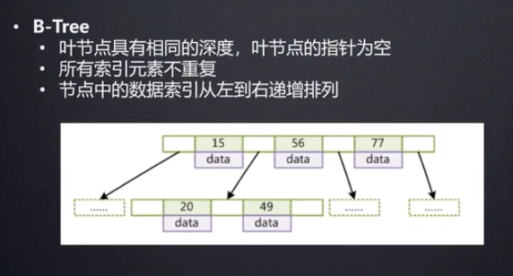
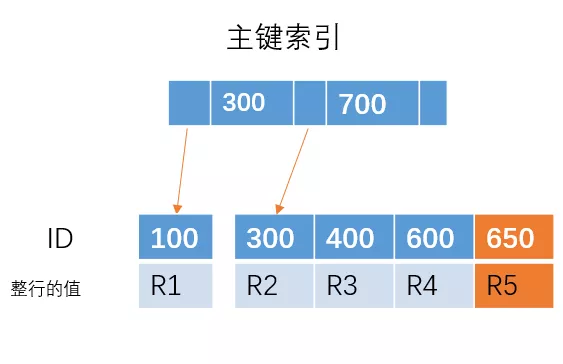

--- 
title: mysql 底层结构
date: 2020-07-16
categories: 
 - 数据库
author:  61
tags: 
 - database
 - 笔记
---

# Mysql底层结构分析(最终选择了什么数据结构作为索引？)

## 索引是帮助Mysql高效获取数据的排序的数据结构

索引数据结构分类

```http
  演示地址：https://www.cs.usfca.edu/~galles/visualization/Algorithms.html
```

  > * 二叉树
  >
  > * 红黑树
  > * Hash表
  > * B-Tree


## 二叉树


演示地址：https://www.cs.usfca.edu/~galles/visualization/BST.html


## 红黑树（弱平衡二叉树 ）插入最大2次旋转，删除最大3次旋转


演示地址：```https://www.cs.usfca.edu/~galles/visualization/RedBlack.html```


```
1、节点是红色或黑色
2、根节点是黑色
3、所有叶子节点是黑色（叶子节点是NIL节点，为了性质5到叶子节点具有相同数目黑色节点）
4、从每个叶子到根的所有路径上不能有两个连续的红色节点
5、从任一节点到其叶子的所有路径包含相同数目黑色节点

```

## Hash表


经过hash运算可以快速的查找，但是无法进行范围查询。


```
1、哈希表是把索引字段映射成对应的哈希码然后再存放在对应的位置，这样的话，如果我们要进行模糊查找的话，显然哈希表这种结构是不支持的，只能遍历这个表。而B+树则可以通过最左前缀原则快速找到对应的数据。

2、如果我们要进行范围查找，例如查找ID为100 ~ 400的人，哈希表同样不支持，只能遍历全表。

3、索引字段通过哈希映射成哈希码，如果很多字段都刚好映射到相同值的哈希码的话，那么形成的索引结构将会是一条很长的链表，这样的话，查找的时间就会大大增加。
```

## B-Tree(多路平衡搜索树)



B树也无法进行很好的范围查找。

## B+Tree(B-Tree变种) 多叉平衡数

* 非叶子节点不存储data，只存储索引（冗余），可以放更多的索引
* 叶子节点包含所有索引字段
* 叶子节点用指针连接，提高区间访问的性能
*  根节点直接放入内存进行查找，进行比对。 2 次 I/O 即可查询完毕
*  支持很好的范围查找，因为叶子节点有指针关联（双向指针）


```
 可以存放多少个非叶子节点： 
 16KB/14B = 16*1024/14 = 1170个
 叶子节点：假设加data 可以存放 1kb  16
 假设 h = 3  可以存放多少个索引 ：1170 * 1170 * 16 > 2000万
```
## mysql 节点大小设置为16kb


## mysql 5.5 的默认配置文件和数据文件的存放路径


```
my.ini：
C:\ProgramData\MySQL\MySQL Server 5.5
数据文件：
C:\ProgramData\MySQL\MySQL Server 5.5\data
```

## MyISAM存储引擎 

```
myisam索引文件和数据文件分离的
frm：表结构；MYD：数据文件；MYI：索引文件
首先是 MyI（index索引） 存储索引进行查找，查到叶子节点存放的是地址，然后根据地址查询MYD（data数据）获取数据。
```

>   
>   

## InnoDB存储引擎 :    

``` 
innoDB索引文件和数据文件是在一起的
frm：表结构；ibd：索引文件和数据文件
```
> 1. ### 表数据文件本身就是按B+ Tree组织的一个索引结构文件
>
> 1. ### 聚集索引：叶子节点包含了完整的数据记录
>
> 1. ### 为什么InnoDB表必须有主键，并且推荐使用整型的自增主键？
>
>    > 对于这颗主键索引的树
>    >
>    > 
>    >
>    > 如果我们插入 ID = 650 的一行数据，那么直接在最右边插入就可以了
>    >
>    > 
>    >
>    > 但是如果插入的是 ID = 350 的一行数据，由于 B+ 树是有序的，那么需要将下面的叶子节点进行移动，腾出位置来插入 ID = 350 的数据，这样就会比较消耗时间，如果刚好 R4 所在的数据页已经满了，需要进行**页分裂**操作，这样会更加糟糕。
>    >
>    > 但是，如果我们的主键是自增的，每次插入的 ID 都会比前面的大，那么我们每次只需要在后面插入就行， 不需要移动位置、分裂等操作，这样可以提高性能。也就是为什么建议使用主键自增的索引。
>    >
>    > 推荐使用整型的自增主键因为索引查找会进行大量的索引数据比较大小，占用空间小，且维护树结构新增叶子节点比较方便,不会大量导致元素的分裂和树的平衡
>    >
>    > 1、如果设置了主键，那么InnoDB会选择主键作为聚集索引、如果没有显式定义主键，则InnoDB会选择第一个不包含有NULL值的唯一索引作为主键索引、如果也没有这样的唯一索引，则InnoDB会选择内置6字节长的ROWID作为隐含的聚集索引(ROWID随着行记录的写入而主键递增)。
>    >
>    > 2、如果表使用自增主键
>    > 那么每次插入新的记录，记录就会顺序添加到当前索引节点的后续位置，主键的顺序按照数据记录的插入顺序排列，自动有序。当一页写满，就会自动开辟一个新的页
>    >
>    > 3、如果使用非自增主键（如果身份证号或学号等）
>    > 由于每次插入主键的值近似于随机，因此每次新纪录都要被插到现有索引页得中间某个位置，此时MySQL不得不为了将新记录插到合适位置而移动数据，甚至目标页面可能已经被回写到磁盘上而从缓存中清掉，此时又要从磁盘上读回来，这增加了很多开销，同时频繁的移动、分页操作造成了大量的碎片，得到了不够紧凑的索引结构，后续不得不通过OPTIMIZE TABLE来重建表并优化填充页面
>
> 1. ### 为什么非主键索引结构叶子节点存储的主键值？（一致性和节省存储空间）
>
>    > 非主键索引结构叶子节点存储的是主键值，使主键索引复用性高，节省空间，保证了主键索引的一致性。
>    >
>    > 减少了出现行移动或者数据页分裂时二级索引的维护工作（当数据需要更新的时候，二级索引不需要修改，只需要修改聚簇索引，一个表只能有一个聚簇索引，其他的都是二级索引，这样只需要修改聚簇索引就可以了，不需要重新构建二级索引）
>    >
>    > 聚簇索引也称为主键索引，其索引树的叶子节点中存的是整行数据，表中行的物理顺序与键值的逻辑（索引）顺序相同。一个表只能包含一个聚集索引。因为索引（目录）只能按照一种方法进行排序。
>    >
>    > 非聚簇索引（普通索引）的叶子节点内容是主键的值。在 InnoDB 里，非主键索引也被称为二级索引（secondary index）。
>    >
>    > *  主键索引和非主键索引有什么区别？
>    >
>    > 例如对于下面这个表(其实就是上面的表中增加了一个k字段),且ID是主键。
>    >
>    > 
>    > 主键索引和非主键索引的示意图如下：
>    > 其中R代表一整行的值。
>    >
>    > 从图中不难看出，主键索引和非主键索引的区别是：非主键索引的叶子节点存放的是**主键的值**，而主键索引的叶子节点存放的是**整行数据**，其中非主键索引也被称为**二级索引**，而主键索引也被称为**聚簇索引**。
>    >
>    > 根据这两种结构我们来进行下查询，看看他们在查询上有什么区别。
>    >
>    > 1、如果查询语句是 select * from table where ID = 100,即主键查询的方式，则只需要搜索 ID 这棵 B+树。
>    >
>    > 2、如果查询语句是 select * from table where k = 1，即非主键的查询方式，则先搜索k索引树，得到ID=100,再到ID索引树搜索一次，这个过程也被称为回表。
>
> 


## 联合索引 :    

``` 
innoDB索引文件和数据文件是在一起的
frm：表结构；ibd：索引文件和数据文件
```

HashMap

组合结构： 左边部分是数组，右边部分是链表或则是红黑树，当<6的时候蜕化为链表，>8的时候转换为红黑树

