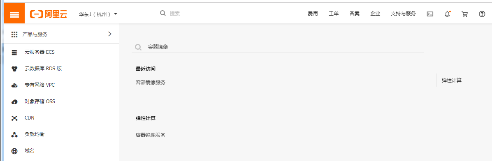
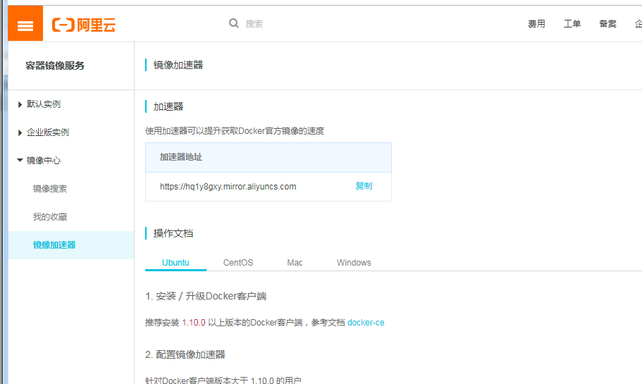
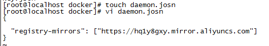
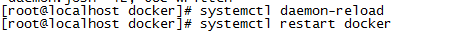
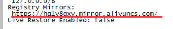
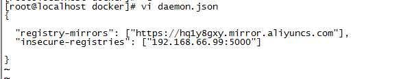
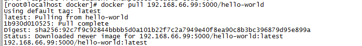
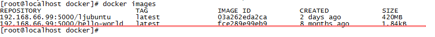

## 前言

docker允许我们通过配置daemon.json为其配置私库加速地址等其他配置。此处只为大家展示配置私库和加速地址的配置。如想进行更多配置请点击[daemon.json](https://docs.docker.com/engine/reference/commandline/dockerd/#daemon-configuration-file)查看更为细致的配置。

### 配置加速地址

由于你懂的原因，很多官方镜像下载速度都很慢，所以这里需要一个加速器。国内目前有腾讯、阿里、百度、DaoCloud等加速器。这里使用的是阿里云的加速器。

 1、首先登录阿里云（需要注册支付宝也可以登录）
 
 2、搜索容器镜像服务 
 
 
 
 3、生成加速地址
 
 
 
 4、将生成的地址配置到daemon.json文件中
 
 `vi /etc/docker/daemon.json`如果没有目录请自行创建
  
  这里我创建错文件后缀了...json写成了josn后面更改了
  
 5、重启docker
 
 `systemctl daemon-reload`
 `systemctl restart docker`
 
  
  
 6、查看是否配置成功
 
 `docker info`
 
  
  
 7、到这里就结束了。后面发现下载速度简直飞一般。
 

## 配置私库

> 私库每个公司的配置都不一致。所以只需要问你们公司leader就好了。但这里我提供了一个我个人的私库地址:192.168.66.99:5000。
   
    1、私库私库那么就是你必须要有一台服务器是存放了很多docker镜像，可以往这个仓库里面进行Pull 和push 。具体如何创建个人镜像仓库可以看网上很多教程。我这里就不做详解了。
    2、和配置加速器一样也是修改daemon.json内的参数即可。多个私库可以用多个逗号隔开。

> 执行：
 
 1、添加私库地址到daemon.json配置中。
 
 `vi /etc/docker/daemon.json`
 
 
 
 > 每个键值对用逗号隔开记得

 2、重启docker并查看是否添加成功
 
 `systemctl daemon-reload`
 `systemctl restart docker`
 `docker info`
 
 3、拉取私库镜像
 
 `docker pull 192.168.66.99:5000/hello-world`

 
 
  ip和端口一定要带上不然就从docker官网上去pull了
  
 4、查看拉取的镜像
 
 `docker images`
 
 
 这里我下了两个我私库的镜像
