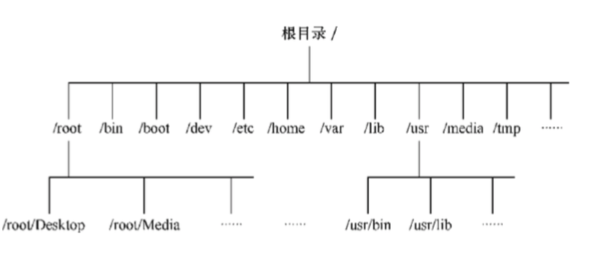

## Linux文件系统目录结构

 Linux的文件系统目录结构是属于分层树形结构。因此，文件系统是由根目录（/）开始往下长，就像一棵倒长的树一样。如图所示：

    安装Linux系统时，系统会建立一些默认的目录，每个目录都有其特殊功能。下面是Linux文件系统一些常用的目录：
- / (根目录)

    根目录位于分层文件系统的最顶层，它包含所有的目录和文件。

- /bin

    存放那些供系统管理员和普通用户使用的重要的linux命令的可执行文件。这个目录下的文件要么是可执行文件，要么是其它目录下的可执行文件的符号链接。一些常用的命令，如cat,cp,ls等都存放在这个目录中

- /boot

    存放用于启动Linux操作系统的所有文件，包括Linux内核的二进制映像。

- /dev

    dev是Device(设备)的缩写, 该目录下存放的是Linux的外部设备，在Linux中访问设备的方式和访问文件的方式是相同的。

- /etc

    这个目录用来存放所有的系统管理所需要的配置文件和子目录。

- /home

    存放一般用户的主目录

- /lib

    这个目录里存放着系统最基本的动态连接共享库，其作用类似于Windows里的DLL文件。几乎所有的应用程序都需要用到这些共享库。

- /mnt

    系统提供该目录是为了让用户临时挂载别的文件系统的，我们可以将光驱挂载在/mnt/上，然后进入该目录就可以查看光驱里的内容了。

- /opt

    这是给主机额外安装软件所摆放的目录。比如你安装一个ORACLE数据库则就可以放到这个目录下。默认是空的。

- /proc

    当前进程和系统的信息，该目录仅存在内存

- /root

    root用户（管理员用户）的主目录。其它用户的主目录都位于/home目录下。普通用户没有权限访问/root目录

- /sbin

    s就是Super User的意思，这里存放的是系统管理员使用的系统管理程序。

- /tmp

    这个目录是用来存放一些临时文件的。

- /usr

     这是一个非常重要的目录，用户的很多应用程序和文件都放在这个目录下，类似于windows下的program files目录。

 - /var

    这个目录中存放着在不断扩充着的东西，我们习惯将那些经常被修改的目录放在这个目录下。包括各种日志文件。

## 常用命令

### ls

> 用于显示目录内容，它的使用权限为所有用户

命令格式: `ls [参数] [文件名]`

|参数|含义|
|----|----|
|-a|列出所有文件|
|-l|以长格式显示指定目标的信息|
**注:** ll不是命令,是 ls -l的别名

### mkdir

> 建立子目录，它的使用权限是所有用户

命令格式：`mkdir [参数] [目录名]`

|参数|含义|
|----|----|
|-m|设定权限<模式>|
|-v|每次创建新目录都返回信息|

### rmdir

> 删除目录

命令格式：`rmdir 目录名`

### cd

> 切换目录

命令格式：`cd 目录名`

### mv

> 用来为文件或目录改名，或者将文件由一个目录移入另一个目录中，它的使用权限是所有用户

命令格式：`mv 源文件名 目标文件名`

### cp

> 将文件或目录复制到其他目录中

命令格式：`cp 源文件名 目标文件名`

### rm

> 删除文件或目录

命令格式：`rm [参数] 文件`

|参数|含义|
|----|----|
|-r|指定将参数中列出的全部目录和子目录均递归删除|
|-f|忽视不存在的文件，不给予提示|

### grep

> 在指定文件中搜索特定的内容，并将含有这些内容的行标准输出

命令格式：`grep [参数] [文件名]`

|参数|含义|
|----|----|
|-v|显示不包含匹配文本的所有行|
|-n|显示匹配行及行号|

### find

> 在目录中搜索文件

命令格式：`find [路径] [参数] [文件名]`

|参数|含义|
|----|----|
|-name|输出搜索结果，并且打印|
|-user|显示搜索文件的属性|

### tail

> 用来显示一个或多个文件的尾部（默认显示10行）

命令格式：`tail [参数] 文件名`

|参数|含义|
|----|----|
|  \+\/\-n |+n表示显示从文件第n行开始的所有行；-n表示显示文件的最后n行|
| \-f |显示完文件的最后一行后，如果文件正在被追加，会继续显示追加的行，直到键入\<Ctrl\> \+ C |

